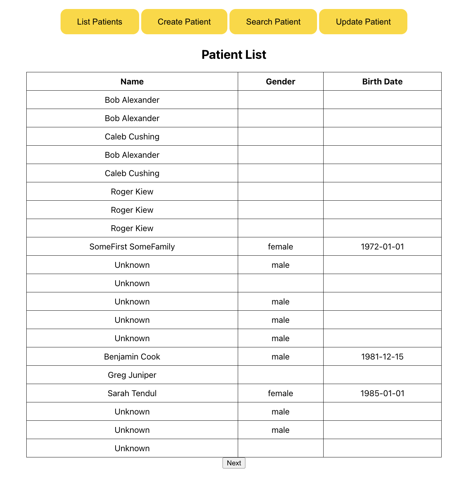
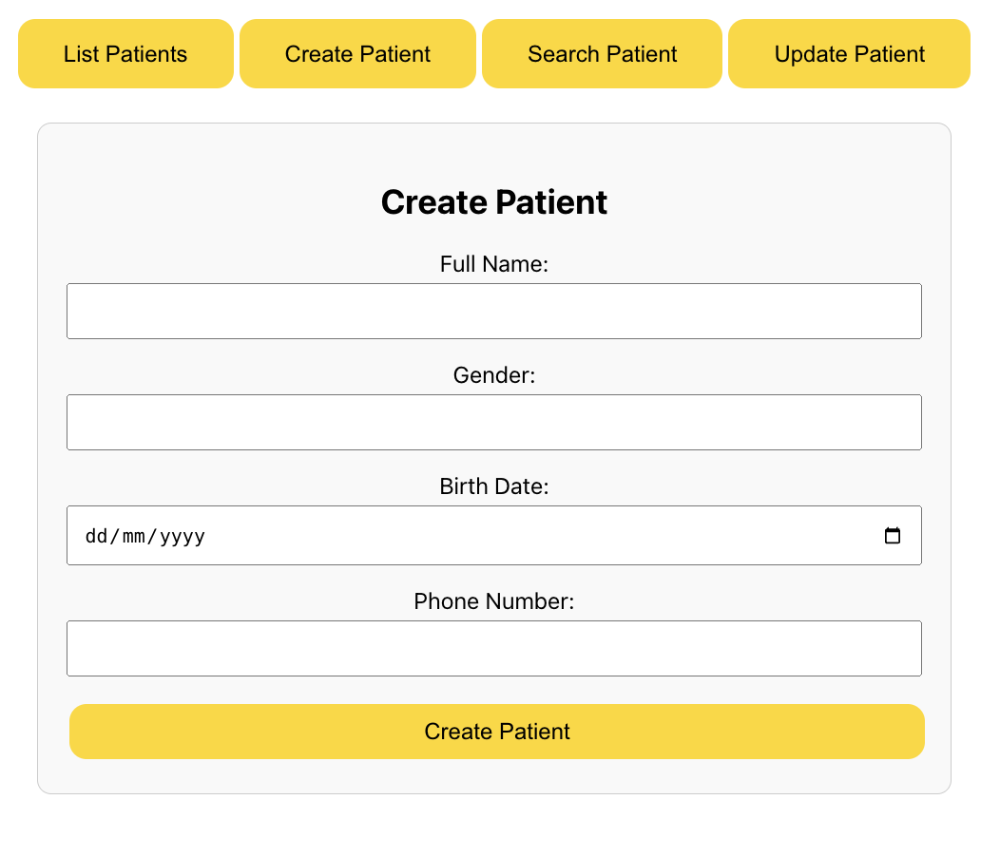
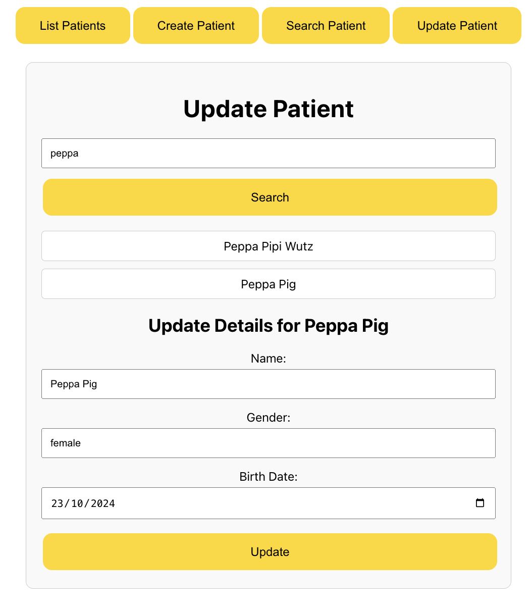
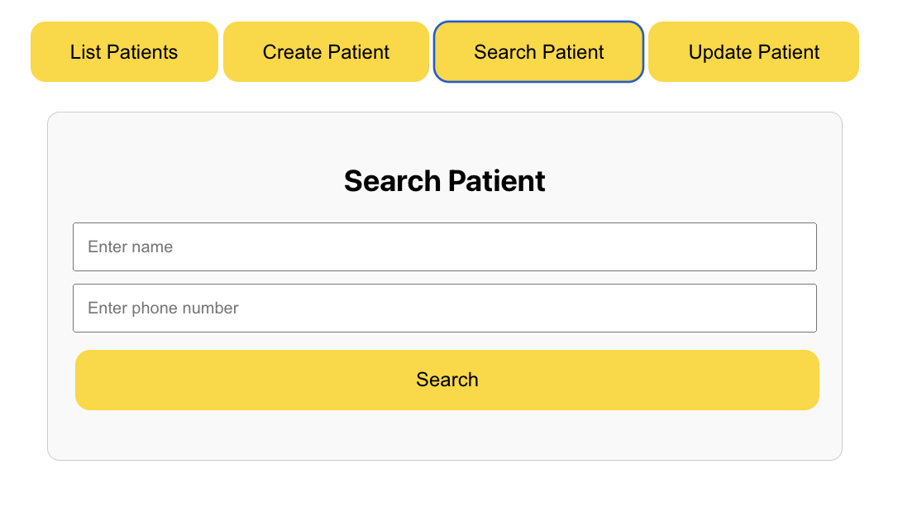

# React App for Managing Patients with HAPI FHIR Server

This React App does the following with a HAPI FHIR JPA server (test server / local):

- List the patients on a FHIR server, displaying their name, gender and date of birth.
- Create patients by submitting a form with the patient's name, gender, date of birth and phone number. Proper validation needs to be done on all fields.
- Allow update of all patients who are on the FHIR server by opening them on the same form and updating details.
- Search patients by their name or phone number.

## Screenshots

### Patient List

### Create Patient

### Update Patient

### Search Patient

